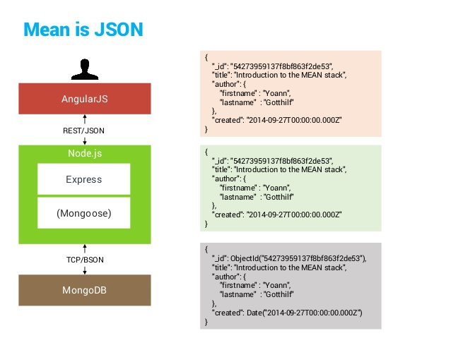

## Documentation
This document gives a description of the architecture of the page, the data we store and our design. This has been 
made early in the project so changes may occur, but it gives a general outline of the project.

A given requirement for the project is that we use Nodejs on the backend, and Angular frontend. This made
it pretty easy deciding on which type of architecture we wanted to go for. We ended up going for the wastly used MEAN
Stack. The MEANS stack provides a set of Open Source components that together provide an end-to-end framework. 
Starting from the top, to the bottom, the stack is made up of:

- Angular: A front-end framework which runs the projects javascript in the web browser. We chose to go for Angular 4,
 simply because it is the newest version of Angular.
- Express: A back-end framework running on top of Node. The Express framework can be used to render everything on the
 page, route between pages and much more. In our project we have decided to use very little of the functionality 
 express provides, focusing on using it for our REST-API.
- Node: A run-time environment that lets us implement our Javascript code back-end. We don't really use much of nodes
 functionality except for running both the server-side and the web-application. 
- MongoDB: A document database. We use this database to store our data, in JSON documents. MongoDB gives us much 
flexibility in deciding both how we want to associate data with each other and how we want to store it.

In addition to express, we also use mongoose to make it easier to connect, and interact with the database. The figure
below illustrates how the different aspects of the stack interact with each other.

We have decided to make a type of music database, using the Spotify api to get data to store in our own database. We 
decided to focus on artists, their albums and their songs. This gives us a rich data source which we also can make a 
simple but useful application for. De tenkte modellene våre ser, per nå, slik ut:

Artist:

    var Artist = new Schema({

        id: {
            type: String
        },
        name: {
            type: String
        },
        genres: {
            type: Array
        },
        imageLink: {
            //Om vi bare velger ett bilde, så String, hvis ikke array
            type: String
        },
        type: {
            type: String
        },
        popularity: {
            type: Number
        }
    });

Album: 

    var Album = new Schema({
        id: {
            type: String
        },
        name: {
            type: String
        },
        genres: {
            type: Array
        },
        imageLink: {
            //Om vi bare velger ett bilde, så String, hvis ikke array
            type: String
        },
        type: {
            type: String
        },
        artists: {
            //List of artist id's
            type: Array
        },
        tracks: {
            //List of track id's
            type: Array
        }
    });
    
Songs:

    var Song = new Schema({
        id: {
            type: String
        },
        name: {
            type: String
        },
        imageLink: {
            //Om vi bare velger ett bilde, så String, hvis ikke array
            type: String
        },
        type: {
            type: String
        },
        duration: {
            type: Number
        },
        popularity: {
            type: Number
        }
    });
    
Write about design: (Fredrik do this pls)