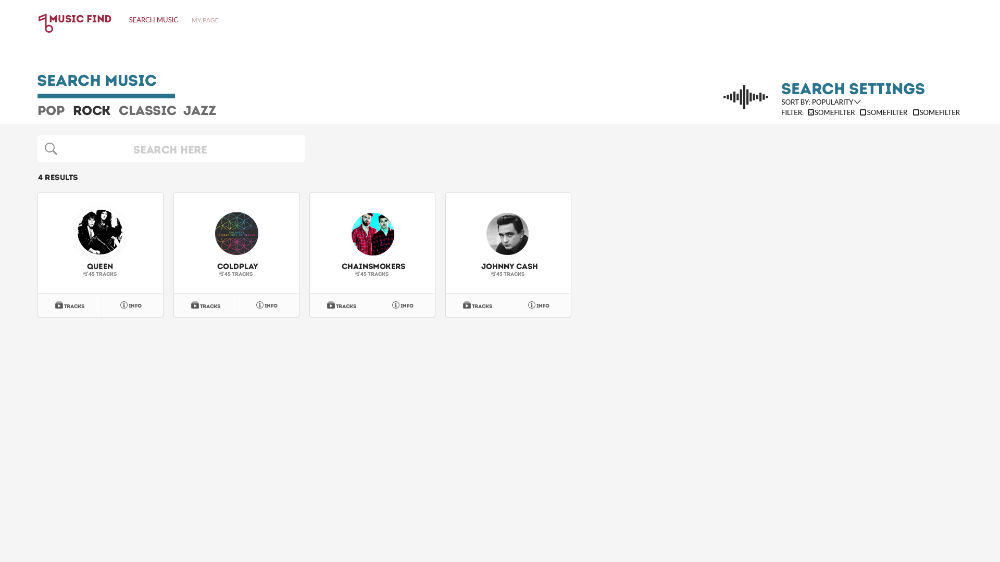

## Documentation
This document contains the description of our project. See the Table of contents for an overview of the  information 
that can be found here. 

### Table of contents:
1. [Achitecture](#Architecture)
2. [Database](#Database) 
3. [Design](#Design)
4. [File Structure](#FileStructure)

### Architecture 
A given requirement for the project is that we use Nodejs on the backend, and Angular frontend. This made
it pretty easy deciding on which type of architecture we wanted to go for. We ended up going for the wastly used MEAN
Stack. The MEANS stack provides a set of Open Source components that together provide an end-to-end framework. 
Starting from the top, to the bottom, the stack is made up of:

- **Angular**: A front-end framework which runs the projects javascript in the web browser. We chose to go for 
Angular 4,
 simply because it is the newest version of Angular.
- **Express**: A back-end **framework** running on top of Node. The Express framework can be used to render 
everything on the page, route between pages and much more. In our project we have decided to use very little of the 
functionality express provides. Focusing on the **Express.Router library** to help us interact with the REST-api and 
working as our production server.
- **Node**: A run-time environment that lets us implement our Javascript code back-end. We don't really use much of 
nodes. The functionality it brings is the role of handling our server side javascript. This is useful since our 
REST-api is written in javascript, and is on the server. Also, our test environment, when up and running, will be run
by node. 
- **MongoDB**: A document database. We use this database to store our data, in JSON documents. MongoDB gives us much 
flexibility in deciding both how we want to associate data with each other and how we want to store it. To make the 
interaction with MongoDB easier we use the plugin **Mongoose**. Mongoose allows us, among other things, to make Schemas 
and use models to store and structure data in our database.  

The figure below illustrates how the different aspects of the stack interact with each other.

### Database 
We have decided to make a type of music database, using the Spotify api to get data to store in our own database. We 
decided to focus on artists, their albums and their songs. This gives us a rich data source which we also can make a 
simple but useful application for. Our models look are as follows:

#### Data Structure 
Artist:

    let Artist = new Schema({

        id:         {type: String},
        name:       {type: String},
        genres:     {type: Array},
        imageLink:  {type: String},
        type:       {type: String},
        popularity: {type: Number},
        albums:     {type: Array},
        tracks:     {type: Array}
    });

Album: 

    let Album = new Schema({
        id:         {type: String},
        name:       {type: String},
        genres:     {type: Array},
        imageLink:  {type: String},
        type:       {type: String},
        artists:    {type: Array},
        tracks:     {type: Array}
    });
    
Songs:

    let Song = new Schema({
        id:         {type: String},
        name:       {type: String},
        imageLink:  {type: String},
        type:       {type: String},
        duration:   {type: Number},
        popularity: {type: Number},
        album:      {type: String,},
        artists:    {type: Array}
    });
    
Users:

    let User = new Schema({
        username:       {type: String,},
        password:       {type: String,},
        search_history: {type: Array,},
        admin:          {
                            type: Boolean,
                            default: false,
                        }
        });
        
Searches:

    let Search = new Schema({
            search_string: {type: String}
        });
    
### Design 
Write about design:

