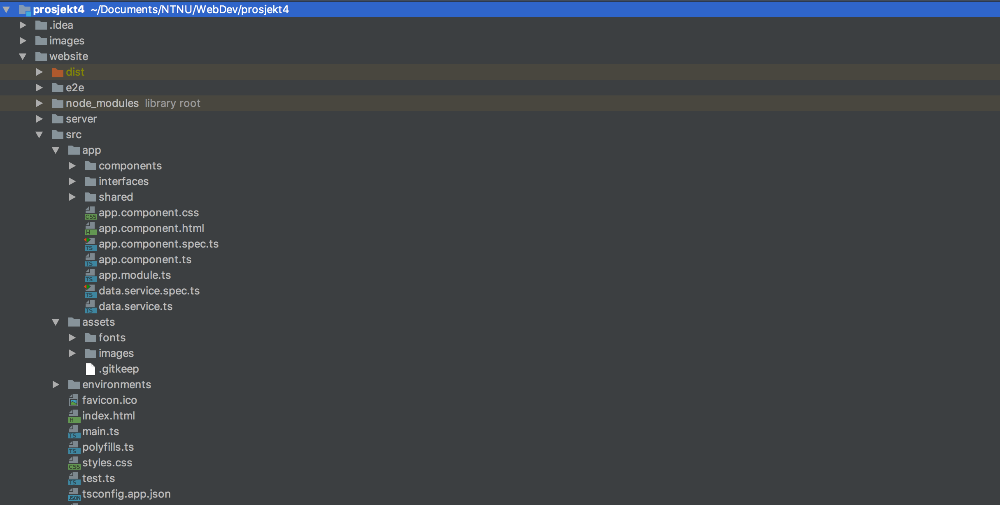
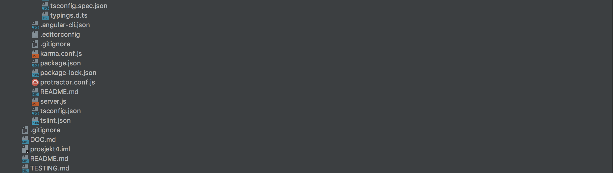

## Documentation
This document contains the description of our project. See the Table of contents for an overview of the  information 
that can be found here. 

### Table of contents:
1. [Achitecture](#Architecture)
2. [Database](#Database) 
3. [Design](#Design)
4. [Project Structure](#ProjectStructure)
5. [Server](#Server)
6. [Application](#Application)

### Architecture 
A given requirement for the project is that we use Nodejs on the backend, and Angular frontend. This made
it pretty easy deciding on which type of architecture we wanted to go for. We ended up going for the wastly used MEAN
Stack. The MEANS stack provides a set of Open Source components that together provide an end-to-end framework. 
Starting from the top, to the bottom, the stack is made up of:

- **Angular**: A front-end framework which runs the projects javascript in the web browser. We chose to go for 
Angular 4, simply because it was the newest version of Angular.
- **Express**: A back-end **framework** running on top of Node. The Express framework can be used to render 
everything on the page, route between pages and much more. In our project we have decided to use very little of the 
functionality express provides. Focusing on the **Express.Router library** to help us interact with the REST-api and 
working as our production server.
- **Node**: A run-time environment that lets us implement our Javascript code back-end. We don't really use much of 
Node. The functionality it brings is the role of handling our server side javascript. This is useful since our 
REST-api is written in javascript, and is on the server. Also, our test environment, when up and running, will be run
by Node. 
- **MongoDB**: A document database. We use this database to store our data, in JSON documents. MongoDB gives us much 
flexibility in deciding both how we want to associate data with each other and how we want to store it. To make the 
interaction with MongoDB easier we use the plugin **Mongoose**. Mongoose allows us, among other things, to make Schemas 
and use models to store and structure data in our database.  

The figure below illustrates how the different aspects of the stack interact with each other.

### Database 
We have decided to make a type of music database, using the Spotify api to get data to store in our own database. We 
decided to focus on artists, their albums and their songs. This gives us a rich data source which we also can make a 
simple but useful application for. Our models look are as follows:

#### Data Structure 
Artist:

    let Artist = new Schema({

        _id:        {type: String},
        name:       {type: String},
        genres:     {type: Array},
        imageLink:  {type: String},
        type:       {type: String},
        popularity: {type: Number},
        albums:     {type: Array},
        tracks:     {type: Array}

    });

Album: 

    let Album = new Schema({
        _id:        {type: String},
        name:       {type: String},
        genres:     {type: Array},
        imageLink:  {type: String},
        type:       {type: String},
        artists:    {type: Array},
        tracks:     {type: Array}
    });
    
Songs:

    let Song = new Schema({
        _id:        {type: String},
        name:       {type: String},
        imageLink:  {type: String},
        type:       {type: String},
        duration:   {type: Number},
        popularity: {type: Number},
        album:      {type: String,},
        artists:    {type: Array}
    });
    
Users:

    let User = new Schema({
        username:         {type: String,},
        password:         {type: String,},
        search_history:   {type: Array,},
        admin:            {
                              type: Boolean,
                              default: false,
                          },
        date_registered:  {
                              type: Date,
                              default: Date.now
                          },
        favorite_artists: {type Array,}
    });

    
### Design 
We have decided to go for a very simple design. The main focus of this project is the database interaction, and we 
felt that with a simple design this focus could be even more enhanced. Seeing as changes may arise during 
development, the images below simply serve as a rough approximation of how the site may end up looking. There may, 
and probably will be made changes to the final design.

### Project Structure 
Our project structure is really straight forward, with a logical folder structure.

Our components are located inn /website/src/app. Here we have 2 different types of components; normal components and shared components (components used multiple times). We also have interfaces in the app folder, these files maps data to angular objects. Each component folder contains the CSS, HTML, TS and test file for the given component.

In the assets folder we have our fonts and images.

Our server code is located under /website/server. Here you will find the DataModels described earlier in models. API routes can be found in router and API page code under static. The code we used for gathering data from the spotify API can be found under spotify. Under controllers you find the code for quering the database and sending the response back to the user.

### Server 

Sortering 

(DANIEL OG FREDRIK)

session og auth av bruker 

(DANIEL)

### Application 

#### Main page / Search page

As for our main page it primarily consists of all search functionality.
It consists of all search results which can be filtered by type(Artists, Albums, Tracks), a search string and categories. There are some minor differences on how the different result types look, and some different functionality concerning interactions with the results. For instance, one can interact with tracks and albums, while tracks is purely for showing track results. Also, we have implemented functionality regarding sorting of the results, mainly one can sort on popularity and name both ascending and descending. In the case where album is the current search type, one can not sort on popularity due to no reference data in the database. 

We have also implemented dynamic load on scroll in our search response grid in the main page. This is done by having an index pointing at how far into the query we have loaded, based on how far you have scrolled. This way the database only gets a certain amount of data every query, and thus optimizing the loadspeed of the website.

#### Dialog (Modal)
The dialog has two implementations, "Song dialog" and "Dialog", both are created by using Material UI. The dialogs were created so that it would be possible to get more extensive information than what was available from the main page.

The Dialog is triggered when you click on the button named "albums" beneath an artist. The dialog dislpays information about the chosen artist, in addition to all albums. If one of the albums is clicked, you get an enlarged picture of the album and a list of all the tracks that belong to the album. Both the dialog and the tracks are scrollable.

The Song dialog is triggered when "tracks" beneath an album is clicked. This dialog dislpays album information and all tracks that belongs to the album.

#### My page
"My page" has two sub pages, "My info" and "Visit history".

My info contains your username and when your profile was created.
You also find your favorite artists here, and a wordcloud generated based on the genres of your favorite artists. Note that the wordcloud is automatically generated and you will not see the wordcloud unless you have at least one favorite artist. If you click any artist in the favorite list, the artist will be displayed like it would on the main page.

Visit history contains information of how many unique visits and total visits you have had. There is also a list showing your latest visits. Note that this list is not clickable.
